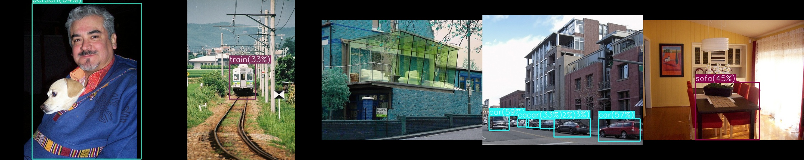

# <div align="center">Object Detection: YOLOv1</div>

---

## [Content]
1. [Description](#description)   
2. [Usage](#usage)  
2-1. [Model Training](#model-training)  
2-2. [Detection Evaluation](#detection-evaluation)  
2-3. [Result Analysis](#result-analysis)  
3. [Contact](#contact)   

---

## [Description]

This is a repository for PyTorch implementation of YOLOv1 following the original paper (https://arxiv.org/abs/1506.02640). 
In addition, we provide model weights that trained on the VOC dataset, so you can quickly train YOLOv1 on your own dataset ! Just download the weight given below and move it into "./weights" directory. If you wanna train YOLOv1 on your dataset from the scratch, add "--scratch" in training command.


 - **Performance Table**

| Model | Dataset | Train | Valid | Size<br><sup>(pixel) | mAP<br><sup>(@0.5:0.95) | mAP<br><sup>(@0.5) | Params<br><sup>(M) | FLOPs<br><sup>(B) |
| :---: | :---: | :---: | :---: | :---: | :---: | :---: | :---: | :---: | 
| YOLOv1<br><sup>(<u>Paper:page_with_curl:</u>)</br> | PASCAL-VOC | trainval2007+2012 | test2007 | 448 | *not reported* | 63.4 | *not reported* | 40.16 |
| YOLOv1 VGG16<br><sup>(<u>Paper:page_with_curl:</u>)</br> | PASCAL-VOC | trainval2007+2012 | test2007 | 448 | *not reported* | 66.4 | *not reported* | *not reported* |
| YOLOv1 VGG16<br><sup>(<u>Our:star:</u>)</br> | PASCAL-VOC | trainval2007+2012 | test2007 | 448 | 34.9 | 67.2 | 25.49 | 127.00 |
| YOLOv1 VGG16-BN<br><sup>(<u>Our:star:</u>)</br> | PASCAL-VOC | trainval2007+2012 | test2007 | 448 | 36.9 | 69.4 | 25.49 | 127.43 |
| YOLOv1 Resnet18<br><sup>(<u>Our:star:</u>)</br> | PASCAL-VOC | trainval2007+2012 | test2007 | 448 | 38.8 | 68.6 | 21.95 | 18.81 |
| YOLOv1 Resnet34<br><sup>(<u>Our:star:</u>)</br> | PASCAL-VOC | trainval2007+2012 | test2007 | 448 | 43.2 | 72.6 | 32.06 | 29.01 |
| YOLOv1 Resnet50<br><sup>(<u>Our:star:</u>)</br> | PASCAL-VOC | trainval2007+2012 | test2007 | 448 | 43.0 | 73.5 | 35.06 | 37.58 |


 - **Pretrained Model Weights Download**

	- [YOLOv1 VGG16](https://drive.google.com/file/d/1yIEFsSXlsOeJVAnt164NBGmZPg8J_ZRm/view?usp=share_link)
	- [YOLOv1 VGG16-BN](https://drive.google.com/file/d/1NSHsPiJc3EVAo8SQX2HqSpCK3iQVocNa/view?usp=share_link)
	- [YOLOv1 ResNet18](https://drive.google.com/file/d/1EETZU5z4c1lff3zOBk6jHFwBsORd065X/view?usp=share_link)
	- [YOLOv1 ResNet34](https://drive.google.com/file/d/1-AAAFd8ADxquma5u36mOHB9eBM514RzI/view?usp=share_link)
	- [YOLOv1 ResNet50](https://drive.google.com/file/d/1oc8dNiQGImQFy2aXmU7NlupL_13vvib4/view?usp=share_link)





## [Usage]

#### Model Training 
 - You can train your own YOLOv1 model using various backbone architectures of ResNet18, ResNet34, ResNet50, ResNet101, VGG16, and VGG16-BN. If you wanna train YOLOv1 on your dataset from the scratch, add "--scratch" in training command like below.

```python
python train.py --exp my_test 
		--data voc.yaml 
		--backbone {vgg16, vgg16-bn, resnet18, resnet34, resnet50, resnet101}
		--scratch(optional)
```


#### Detection Evaluation
 - It computes detection metric via mean Average Precision(mAP) with IoU of 0.5, 0.75, 0.5:0.95. I follow the evaluation code with the reference on https://github.com/rafaelpadilla/Object-Detection-Metrics

```python
python val.py --exp my_test --data voc.yaml --ckpt-name best.pt
```


#### Result Analysis
 - After training is done, you will get the results shown below.

<div align="center">

  <a href=""></a>

</div>


```log
2022-11-25 18:37:35 | YOLOv1 Architecture Info - Params(M): 35.07, FLOPS(B): 32.41
2022-11-25 18:41:48 | [Train-Epoch:001] multipart: 13.6807  obj: 0.3439  noobj: 12.8928  box: 0.5445  cls: 4.1677  
2022-11-25 18:45:52 | [Train-Epoch:002] multipart: 3.8190  obj: 0.4812  noobj: 0.1155  box: 0.3377  cls: 1.5916  
2022-11-25 18:49:58 | [Train-Epoch:003] multipart: 3.3824  obj: 0.4848  noobj: 0.1571  box: 0.2936  cls: 1.3509  
2022-11-25 18:54:05 | [Train-Epoch:004] multipart: 3.1404  obj: 0.4771  noobj: 0.1755  box: 0.2745  cls: 1.2028  
2022-11-25 18:58:11 | [Train-Epoch:005] multipart: 3.0149  obj: 0.4663  noobj: 0.1998  box: 0.2640  cls: 1.1287  
2022-11-25 19:02:17 | [Train-Epoch:006] multipart: 2.8718  obj: 0.4488  noobj: 0.2169  box: 0.2517  cls: 1.0560  
2022-11-25 19:06:23 | [Train-Epoch:007] multipart: 2.7623  obj: 0.4314  noobj: 0.2359  box: 0.2440  cls: 0.9928  
2022-11-25 19:10:29 | [Train-Epoch:008] multipart: 2.6833  obj: 0.4180  noobj: 0.2470  box: 0.2365  cls: 0.9595  
2022-11-25 19:14:35 | [Train-Epoch:009] multipart: 2.6262  obj: 0.4060  noobj: 0.2590  box: 0.2335  cls: 0.9235  
2022-11-25 19:18:43 | [Train-Epoch:010] multipart: 2.5375  obj: 0.3966  noobj: 0.2653  box: 0.2251  cls: 0.8827  
2022-11-25 19:19:40 | 
	 - Average Precision (AP) @[ IoU=0.50:0.95 | area=   all | maxDets=100 ] = 0.240
	 - Average Precision (AP) @[ IoU=0.50      | area=   all | maxDets=100 ] = 0.534
	 - Average Precision (AP) @[ IoU=0.75      | area=   all | maxDets=100 ] = 0.172
	 - Average Precision (AP) @[ IoU=0.50:0.95 | area= small | maxDets=100 ] = 0.007
	 - Average Precision (AP) @[ IoU=0.50      | area= small | maxDets=100 ] = 0.031
	 - Average Precision (AP) @[ IoU=0.50:0.95 | area=medium | maxDets=100 ] = 0.087
	 - Average Precision (AP) @[ IoU=0.50      | area=medium | maxDets=100 ] = 0.249
	 - Average Precision (AP) @[ IoU=0.50:0.95 | area= large | maxDets=100 ] = 0.298
	 - Average Precision (AP) @[ IoU=0.50      | area= large | maxDets=100 ] = 0.626

                                                ...

2022-11-26 05:07:31 | [Train-Epoch:149] multipart: 1.2090  obj: 0.2616  noobj: 0.2845  box: 0.1177  cls: 0.2167  
2022-11-26 05:07:32 | [Best mAP at 140]

	 - Average Precision (AP) @[ IoU=0.50:0.95 | area=   all | maxDets=100 ] = 0.438
	 - Average Precision (AP) @[ IoU=0.50      | area=   all | maxDets=100 ] = 0.730
	 - Average Precision (AP) @[ IoU=0.75      | area=   all | maxDets=100 ] = 0.439
	 - Average Precision (AP) @[ IoU=0.50:0.95 | area= small | maxDets=100 ] = 0.083
	 - Average Precision (AP) @[ IoU=0.50      | area= small | maxDets=100 ] = 0.191
	 - Average Precision (AP) @[ IoU=0.50:0.95 | area=medium | maxDets=100 ] = 0.199
	 - Average Precision (AP) @[ IoU=0.50      | area=medium | maxDets=100 ] = 0.445
	 - Average Precision (AP) @[ IoU=0.50:0.95 | area= large | maxDets=100 ] = 0.510
	 - Average Precision (AP) @[ IoU=0.50      | area= large | maxDets=100 ] = 0.788
```


<div align="center">

<a href=""></a> <a href=""></a> <a href=""></a> <a href=""></a>

</div>


---
## [Contact]
- Author: Jiho Park  
- Email: pjh5672.dev@gmail.com  