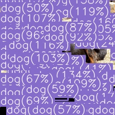
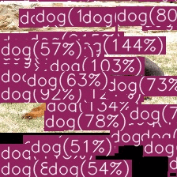

# <div align="center">YOLOv1</div>

---

## [Contents]
1. [Description](#description)   
2. [Contribution](#contact)   

---

## [Description]

This is a repository for reproducing YOLOv1 detection model following the [*original paper*](https://arxiv.org/abs/1506.02640)

### - Step 1. Train single image for checking model recognizing  
- **Train: toy_dataset/train_1, Val: toy_dataset/train_1**
- Intentional overfitting without any augmentation
- Multi-part, objectness, noobjectness, box, confidence losses should be near 0.0 after 100 epochs with learning rate of 1e-4
- Available to check step-by-step whether the bounding box coordinate transformation for training model is correct through **"data_info.csv"** in the toy_dataset folder.

<div align="center">
<div> Inference result for 150 epochs </div>


</div>

### - Step 2. Train 9 images for batch-training  
- **Train: toy_dataset/train_2, Val: toy_dataset/train_1**
- Intentional overfitting without any augmentation
- Setting learning rate to 1e-4

<div align="center">
  <div> Inference result for 150 epochs </div>


</div>

### - Step 3. Train 10 images including one background image
- **Train: toy_dataset/train_3, Val: toy_dataset/train_2**
- Intentional overfitting without any augmentation
- Setting learning rate to 1e-4
- Exception handling for non-detectable case
- Best mAP value should be approximately as below

<div align="center">
  <div> Non-detectable case (Bird) </div>


</div>

<div align="center">
Best mAP performance training after 150 epochs

```log
  Average Precision  (AP) @[ IoU=0.50:0.95 | area=   all | maxDets=100 ] = 0.516
  Average Precision  (AP) @[ IoU=0.50      | area=   all | maxDets=100 ] = 0.833
  Average Precision  (AP) @[ IoU=0.75      | area=   all | maxDets=100 ] = 0.582
  Average Precision  (AP) @[ IoU=0.50:0.95 | area= small | maxDets=100 ] = -1.000
  Average Precision  (AP) @[ IoU=0.50:0.95 | area=medium | maxDets=100 ] = -1.000
  Average Precision  (AP) @[ IoU=0.50:0.95 | area= large | maxDets=100 ] = 0.516
  Average Recall     (AR) @[ IoU=0.50:0.95 | area=   all | maxDets=  1 ] = 0.567
  Average Recall     (AR) @[ IoU=0.50:0.95 | area=   all | maxDets= 10 ] = 0.567
  Average Recall     (AR) @[ IoU=0.50:0.95 | area=   all | maxDets=100 ] = 0.567
  Average Recall     (AR) @[ IoU=0.50:0.95 | area= small | maxDets=100 ] = -1.000
  Average Recall     (AR) @[ IoU=0.50:0.95 | area=medium | maxDets=100 ] = -1.000
  Average Recall     (AR) @[ IoU=0.50:0.95 | area= large | maxDets=100 ] = 0.567

```

</div>

<div align="center">
  <div> Inference result for 150 epochs </div>


</div>


## [Contact]
- Author: Jiho Park  
- Email: pjh5672.dev@gmail.com  